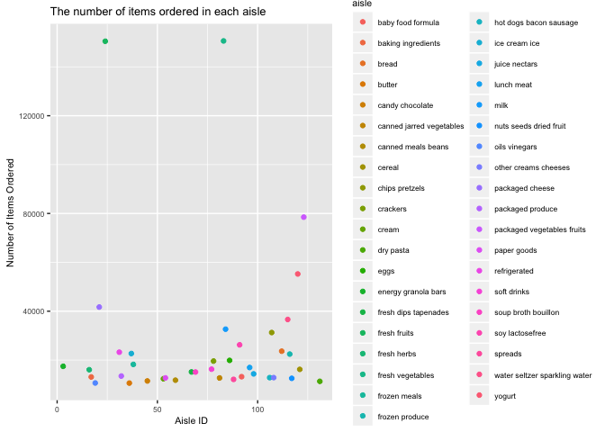
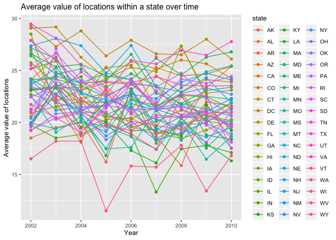
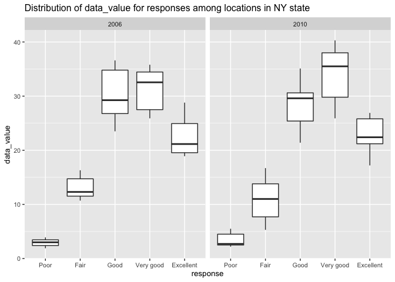
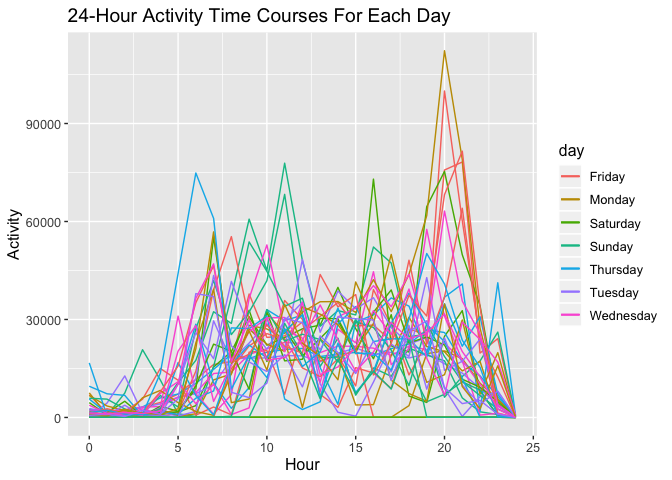

p8105\_hw2\_jf3285
================
Jiarui Fu
10/14/2019

## Problem 1

This problem uses the Instacart data. The goal is to do some exploration
of this dataset.  
Q1. There are 134 aisles. Aisle 83 (fresh vegetables, most) and aisle 24
(fresh fruits, second most) are the most items ordered from.  
Q2. The plot is shown below. Aisles are arranged by their respective
IDs. It can be seen that the two aisles with the most number of items
ordered are fresh vegetables and fresh fruits, which corresponds to the
finding in Q1.

``` r
# load the data
library(p8105.datasets)
data("instacart")
instacart
```

    ## # A tibble: 1,384,617 x 15
    ##    order_id product_id add_to_cart_ord… reordered user_id eval_set
    ##       <int>      <int>            <int>     <int>   <int> <chr>   
    ##  1        1      49302                1         1  112108 train   
    ##  2        1      11109                2         1  112108 train   
    ##  3        1      10246                3         0  112108 train   
    ##  4        1      49683                4         0  112108 train   
    ##  5        1      43633                5         1  112108 train   
    ##  6        1      13176                6         0  112108 train   
    ##  7        1      47209                7         0  112108 train   
    ##  8        1      22035                8         1  112108 train   
    ##  9       36      39612                1         0   79431 train   
    ## 10       36      19660                2         1   79431 train   
    ## # … with 1,384,607 more rows, and 9 more variables: order_number <int>,
    ## #   order_dow <int>, order_hour_of_day <int>,
    ## #   days_since_prior_order <int>, product_name <chr>, aisle_id <int>,
    ## #   department_id <int>, aisle <chr>, department <chr>

``` r
instacart %>% 
  # Q1: How many aisles are there, and which aisles are the most items ordered from?
  # count the number of times each aisle is ordered
  group_by(aisle_id, aisle) %>% 
  summarise(item_ordered_from_aisle=n()) %>% 
  
  # Q2: make a plot that shows the number of items ordered in each aisle
  # limit to aisles with more than 10000 items ordered
  filter(item_ordered_from_aisle > 10000) %>% 
  ggplot(aes(x = aisle_id, y = item_ordered_from_aisle)) + 
  geom_point(aes(color = aisle)) + 
  labs(title = "The number of items ordered in each aisle",
       x = "Aisle ID",
       y = "Number of Items Ordered") + theme(text = element_text(size=8))
```

<!-- -->

Q3. The table is shown below. The three most popular items in aisle
baking ingredients are: Light Brown Sugar, Pure Baking Soda, Cane Sugar
(list by the number of times each item is ordered). The three most
popular items in aisle dog food care are: Snack Sticks Chicken & Rice
Recipe Dog Treats, Organix Chicken & Brown Rice Recipe, and Small Dog
Biscuits (list by the number of times each item is ordered). The three
most popular items in aisle packaged vegetable fruits are: Organic Baby
Spinach, Organic Raspberries and Organic Blueberries (list by the number
of times each item is ordered).

``` r
# load the data
library(p8105.datasets)
data("instacart") 

# Q3: make a table showing the three most popular items in the specified aisles below
instacart %>% 
  # limit to only three aisles
  filter(aisle %in% c("baking ingredients", "dog food care", "packaged vegetables fruits")) %>% 
  # count the number of times each item is ordered
  group_by(aisle, product_name) %>%
  summarize(number_of_times_item_ordered = n()) %>% 
  # count(product_name, name = "number_of_times_item_ordered") %>% 
  # keep the three most popular items in each of the aisles
  filter(min_rank(desc(number_of_times_item_ordered)) < 4) %>% 
  knitr::kable()
```

| aisle                      | product\_name                                 | number\_of\_times\_item\_ordered |
| :------------------------- | :-------------------------------------------- | -------------------------------: |
| baking ingredients         | Cane Sugar                                    |                              336 |
| baking ingredients         | Light Brown Sugar                             |                              499 |
| baking ingredients         | Pure Baking Soda                              |                              387 |
| dog food care              | Organix Chicken & Brown Rice Recipe           |                               28 |
| dog food care              | Small Dog Biscuits                            |                               26 |
| dog food care              | Snack Sticks Chicken & Rice Recipe Dog Treats |                               30 |
| packaged vegetables fruits | Organic Baby Spinach                          |                             9784 |
| packaged vegetables fruits | Organic Blueberries                           |                             4966 |
| packaged vegetables fruits | Organic Raspberries                           |                             5546 |

``` r
# load the data
library(p8105.datasets)
data("instacart")

# Q4: make a table showing the mean hour of the day at which the specified products below are ordered on each day of the week
# change order_dow's data type to factor
instacart$order_dow = as.factor(instacart$order_dow)
instacart %>% 
  # recode order_dow into each day of the week based on 0-6 => Sun to Sat
  mutate(order_dow = recode(order_dow, 
                            "0" = "Sun", "1" = "Mon", "2" = "Tue", "3" = "Wed", 
                            "4" = "Thu", "5" = "Fri", "6" = "Sat")) %>% 
  # limit to only two products
  filter(product_name %in% c("Pink Lady Apples", "Coffee Ice Cream")) %>% 
  # count the mean hour of the day at which they are ordered on each day of the week 
  group_by(order_dow, product_name) %>% 
  summarise(mean_hour = mean(order_hour_of_day)) %>% 
  # produce a 2*7 table 
  pivot_wider(id_cols = c(order_dow, product_name, mean_hour),
              names_from = order_dow,
              values_from = mean_hour) %>% 
  knitr::kable(digits = 1)
```

| product\_name    |  Sun |  Mon |  Tue |  Wed |  Thu |  Fri |  Sat |
| :--------------- | ---: | ---: | ---: | ---: | ---: | ---: | ---: |
| Coffee Ice Cream | 13.8 | 14.3 | 15.4 | 15.3 | 15.2 | 12.3 | 13.8 |
| Pink Lady Apples | 13.4 | 11.4 | 11.7 | 14.2 | 11.6 | 12.8 | 11.9 |

Dataset description: The instacart dataset has 1384617 rows and 15
columns. The dataset is relatively tidy, given that each variable forms
a column, each observation forms a row and each type of observational
unit forms a table. Some key variables are add\_to\_cart\_order - the
order of the item being added to cart in each order, reordered - the
number of times the item being ordered again, order\_dow - the day of
the week the item being ordered, order\_hour\_of\_day - the hour of the
day the item bring ordered, product\_name - the name of the product,
aisle - aisle name, department - department name, etc.

For example, the order\_dow ranges \[\] from (0, 6), representing Sunday
to Saturday in a week. The order\_hour\_of\_day ranges from (0, 23),
representing the 24 hours in a day.

## Problem 2

This problem uses the BRFSS data.

``` r
# load the data
library(p8105.datasets)
data("brfss_smart2010")

# data cleaning
# change response's data type to factor
brfss_smart2010$Response = as.factor(brfss_smart2010$Response)
tidy_data = 
brfss_smart2010 %>% 
  janitor::clean_names() %>%
  # format the data to use appropriate variable names
  rename(state = locationabbr,
         county = locationdesc) %>% 
  # focus on the "Overall Health" topic
  filter(topic == "Overall Health") %>% 
  # include only responses from "Excellent" to "Poor"
  filter (response %in% c("Excellent", "Very good", "Good", "Fair", "Poor")) %>% 
  # organize responses as a factor taking levels ordered from “Poor” to “Excellent”
  mutate(response = forcats::fct_relevel(response, c("Poor", "Fair", "Good", "Very good", "Excellent"))) %>% 
  arrange(response)
tidy_data
```

    ## # A tibble: 10,625 x 23
    ##     year state county class topic question response sample_size data_value
    ##    <int> <chr> <chr>  <chr> <chr> <chr>    <fct>          <int>      <dbl>
    ##  1  2010 AL    AL - … Heal… Over… How is … Poor              45        5.5
    ##  2  2010 AL    AL - … Heal… Over… How is … Poor              66        6.4
    ##  3  2010 AL    AL - … Heal… Over… How is … Poor              35        4.2
    ##  4  2010 AZ    AZ - … Heal… Over… How is … Poor              62        3.5
    ##  5  2010 AZ    AZ - … Heal… Over… How is … Poor              49        5.7
    ##  6  2010 AZ    AZ - … Heal… Over… How is … Poor              30        4  
    ##  7  2010 AR    AR - … Heal… Over… How is … Poor              21        3  
    ##  8  2010 AR    AR - … Heal… Over… How is … Poor              36        3.8
    ##  9  2010 AR    AR - … Heal… Over… How is … Poor              16        2.4
    ## 10  2010 CA    CA - … Heal… Over… How is … Poor              23        2.4
    ## # … with 10,615 more rows, and 14 more variables:
    ## #   confidence_limit_low <dbl>, confidence_limit_high <dbl>,
    ## #   display_order <int>, data_value_unit <chr>, data_value_type <chr>,
    ## #   data_value_footnote_symbol <chr>, data_value_footnote <chr>,
    ## #   data_source <chr>, class_id <chr>, topic_id <chr>, location_id <chr>,
    ## #   question_id <chr>, respid <chr>, geo_location <chr>

``` r
# Q1: In 2002, which states were observed at 7 or more locations? What about in 2010?
# year 2002
tidy_data %>% 
  # set year = 2002
  filter(year == 2002) %>% 
  # count the number of locations that each state was observed at
  group_by(state) %>% 
  summarise(number_of_locations = n_distinct(county)) %>% 
  # set observations at 7 or more locations
  filter(number_of_locations >= 7)
```

    ## # A tibble: 6 x 2
    ##   state number_of_locations
    ##   <chr>               <int>
    ## 1 CT                      7
    ## 2 FL                      7
    ## 3 MA                      8
    ## 4 NC                      7
    ## 5 NJ                      8
    ## 6 PA                     10

``` r
# year 2010
tidy_data %>% 
  # set tear = 2010
  filter(year == 2010) %>% 
  # count the number of locations that each state was observed at
  group_by(state) %>% 
  summarise(number_of_locations = n_distinct(county)) %>%
  # set observations at 7 or more locations
  filter(number_of_locations >= 7)
```

    ## # A tibble: 14 x 2
    ##    state number_of_locations
    ##    <chr>               <int>
    ##  1 CA                     12
    ##  2 CO                      7
    ##  3 FL                     41
    ##  4 MA                      9
    ##  5 MD                     12
    ##  6 NC                     12
    ##  7 NE                     10
    ##  8 NJ                     19
    ##  9 NY                      9
    ## 10 OH                      8
    ## 11 PA                      7
    ## 12 SC                      7
    ## 13 TX                     16
    ## 14 WA                     10

``` r
# Q2
# construct a dataset that is limited to Excellent responses, and contains, year, state, and a variable that averages the data_value across locations within a state
average_state_locations = 
tidy_data %>% 
  # limit to Excellent responses
  filter(response == "Excellent") %>%
  # contain year, state
  group_by(year, state) %>% 
  # create a new variable that averages the data_value across locations within a state
  summarise(avg_data_value = mean(data_value)) 
average_state_locations
```

    ## # A tibble: 443 x 3
    ## # Groups:   year [9]
    ##     year state avg_data_value
    ##    <int> <chr>          <dbl>
    ##  1  2002 AK              27.9
    ##  2  2002 AL              18.5
    ##  3  2002 AR              24.1
    ##  4  2002 AZ              24.1
    ##  5  2002 CA              22.7
    ##  6  2002 CO              23.1
    ##  7  2002 CT              29.1
    ##  8  2002 DC              29.3
    ##  9  2002 DE              20.9
    ## 10  2002 FL              25.7
    ## # … with 433 more rows

``` r
# make a “spaghetti” plot of this average value over time within a state
# make a plot showing a line for each state across years
average_state_locations %>% 
  ggplot(aes(x = year, y = avg_data_value, color = state)) + 
  geom_point() +
  geom_line(aes(group = state)) + 
  labs(title = "Average value of locations within a state over time",
       x = "Year",
       y = "Average value of locations") + theme(text = element_text(size=10))
```

    ## Warning: Removed 4 rows containing missing values (geom_point).

    ## Warning: Removed 3 rows containing missing values (geom_path).

<!-- -->

``` r
# Q3
# make a two-panel plot showing, for the years 2006, and 2010, distribution of data_value for responses (“Poor” to “Excellent”) among locations in NY State
tidy_data %>% 
  # set year = 2006 and 2010
  filter(year %in% c(2006, 2010)) %>% 
  # set location in NY State
  filter(state == "NY") %>% 
  # two-panel plot
  ggplot(aes(x = response, y = data_value)) +
  geom_boxplot() + 
  labs(title = "Distribution of data_value for responses among locations in NY state",
       x = "response",
       y = "data_value") + theme(text = element_text(size=10)) +
  facet_grid(~year)
```

<!-- -->

Q1. In 2002, 6 states were observed at 7 or more locations, including
CT, FL, MA, NC, NJ, PA. In 2010, 14 states were observed at 7 or more
locations, including CA, CO, FL, MA, MD, NC, NE, NJ, NY OH, PA, SC, TX,
WA.

## Problem 3

This problem uses five weeks of accelerometer data collected on a 63
year-old male with BMI 25.

``` r
accel_data = 
  # load, tidy the data
  read_csv("data/accel_data.csv") %>%
  janitor::clean_names() %>%
  # include a weekday vs weekend variable
  mutate(weekday_vs_weekend =
         ifelse(day %in% c("Saturday", "Sunday"), "weekend", "weekday")) %>% 
  # include all originally observed variables and values 
  select(week, day_id, day, weekday_vs_weekend, everything())

# aggregate across minutes to create a total activity variable for each day
# create a table showing these totals
accel_data %>%  
  mutate(total_activity_daily = rowSums(.[5:1444])) %>% 
  select(week, day_id, day, weekday_vs_weekend, total_activity_daily) %>% 
  knitr::kable()
```

| week | day\_id | day       | weekday\_vs\_weekend | total\_activity\_daily |
| ---: | ------: | :-------- | :------------------- | ---------------------: |
|    1 |       1 | Friday    | weekday              |              480542.62 |
|    1 |       2 | Monday    | weekday              |               78828.07 |
|    1 |       3 | Saturday  | weekend              |              376254.00 |
|    1 |       4 | Sunday    | weekend              |              631105.00 |
|    1 |       5 | Thursday  | weekday              |              355923.64 |
|    1 |       6 | Tuesday   | weekday              |              307094.24 |
|    1 |       7 | Wednesday | weekday              |              340115.01 |
|    2 |       8 | Friday    | weekday              |              568839.00 |
|    2 |       9 | Monday    | weekday              |              295431.00 |
|    2 |      10 | Saturday  | weekend              |              607175.00 |
|    2 |      11 | Sunday    | weekend              |              422018.00 |
|    2 |      12 | Thursday  | weekday              |              474048.00 |
|    2 |      13 | Tuesday   | weekday              |              423245.00 |
|    2 |      14 | Wednesday | weekday              |              440962.00 |
|    3 |      15 | Friday    | weekday              |              467420.00 |
|    3 |      16 | Monday    | weekday              |              685910.00 |
|    3 |      17 | Saturday  | weekend              |              382928.00 |
|    3 |      18 | Sunday    | weekend              |              467052.00 |
|    3 |      19 | Thursday  | weekday              |              371230.00 |
|    3 |      20 | Tuesday   | weekday              |              381507.00 |
|    3 |      21 | Wednesday | weekday              |              468869.00 |
|    4 |      22 | Friday    | weekday              |              154049.00 |
|    4 |      23 | Monday    | weekday              |              409450.00 |
|    4 |      24 | Saturday  | weekend              |                1440.00 |
|    4 |      25 | Sunday    | weekend              |              260617.00 |
|    4 |      26 | Thursday  | weekday              |              340291.00 |
|    4 |      27 | Tuesday   | weekday              |              319568.00 |
|    4 |      28 | Wednesday | weekday              |              434460.00 |
|    5 |      29 | Friday    | weekday              |              620860.00 |
|    5 |      30 | Monday    | weekday              |              389080.00 |
|    5 |      31 | Saturday  | weekend              |                1440.00 |
|    5 |      32 | Sunday    | weekend              |              138421.00 |
|    5 |      33 | Thursday  | weekday              |              549658.00 |
|    5 |      34 | Tuesday   | weekday              |              367824.00 |
|    5 |      35 | Wednesday | weekday              |              445366.00 |

``` r
# tidied dataset
# change the wider format to longer
# create a new variable "minute" to replace the activity for each minute, and a new variable "activity" to represent the corresponding activity count
clean_data = 
  pivot_longer(accel_data, cols = activity_1:activity_1440,
               names_to = "minute",
               values_to = "activity"
               ) %>% 
  # "activity_" is removed from the entire minute column to reflect time (minutes)
  mutate_all(~gsub("activity_", "", .)) %>% 
  # change the data type for week and day_id to numeric
  mutate(week = as.numeric(week),
         day_id = as.numeric(day_id)) %>% 
  # change the data type for minute and activity to numeric
  mutate(minute = as.numeric(minute),
         activity = as.numeric(activity)) %>% 
  select(week, day_id, day, weekday_vs_weekend, everything()) %>% 
  # group by each day
  group_by(day_id)
clean_data
```

    ## # A tibble: 50,400 x 6
    ## # Groups:   day_id [35]
    ##     week day_id day    weekday_vs_weekend minute activity
    ##    <dbl>  <dbl> <chr>  <chr>               <dbl>    <dbl>
    ##  1     1      1 Friday weekday                 1     88.4
    ##  2     1      1 Friday weekday                 2     82.2
    ##  3     1      1 Friday weekday                 3     64.4
    ##  4     1      1 Friday weekday                 4     70.0
    ##  5     1      1 Friday weekday                 5     75.0
    ##  6     1      1 Friday weekday                 6     66.3
    ##  7     1      1 Friday weekday                 7     53.8
    ##  8     1      1 Friday weekday                 8     47.8
    ##  9     1      1 Friday weekday                 9     55.5
    ## 10     1      1 Friday weekday                10     43.0
    ## # … with 50,390 more rows

``` r
# create a new dataset to reformat the tidied dataset
data_by_hour = 
  clean_data %>%
  # minute is transformed to hour using quotient
  # 1440 minutes -> 24 hours
  mutate(hour = minute%/%60) %>% 
  # create a unique day variable
  mutate(unique_day = paste0("Week ",week,": ",day)) %>%
  group_by(week, day, unique_day, hour) %>% 
  # sum the hourly activity 
  mutate(hourly_activity = sum(activity)) %>% 
  select(day, unique_day, hour, hourly_activity) %>% 
  # remove duplicate rows
  distinct() 

# create five different datasets for Week 1 to 5
wk1 = 
data_by_hour %>% 
  filter (week == 1)

wk2 = 
  data_by_hour %>% 
  filter (week == 2)

wk3 = data_by_hour %>% 
  filter (week == 3)

wk4 = data_by_hour %>% 
  filter (week == 4) 

wk5 = data_by_hour %>% 
  filter (week == 5)

# make a single-panel plot that shows the 24-hour activity time courses for each day and use color to indicate day of the week
# 35 lines - 35 days in total
# 7 legends - group by day of the week
ggplot() +
geom_line(wk1, mapping = aes(x = hour, y = hourly_activity, color = day)) +
geom_line(wk2, mapping = aes(x = hour, y = hourly_activity, color = day)) +
geom_line(wk3, mapping = aes(x = hour, y = hourly_activity, color = day)) +
geom_line(wk4, mapping = aes(x = hour, y = hourly_activity, color = day)) +
geom_line(wk5, mapping = aes(x = hour, y = hourly_activity, color = day)) +
labs(title = "24-Hour Activity Time Courses For Each Day",
       x = "Hour",
       y = "Activity") + theme(text = element_text(size=12)) 
```

<!-- -->

Q1. The final dataset includes the week number from 1 to 5 representing
the five weeks throughout the study \[dbl\], the day\_id from 1 to 7
representing the seven days in week \[dbl\], the day of the week from
Monday to Sunday \[chr\], the weekday vs weekend variable representing
if the day is weekday or weekend \[chr\], minute representing the minute
of a day \[dbl\], and minute activity level \[dbl\].  
Q2. In the table that shows total activity by each day, there are not
many apparent trends. But it can be easily seen that the total
activities for Week 1 Monday, Week 4 Saturday and Week 5 Saturday are
extremely low compared to those of other days.  
Q3. In the plot that shows the 24-hour activity time courses for each
day, it can be seen that there are about four peaks during the five-week
study where the peaks of activity for each day are around Thursday at
6am, Sunday at 11am, Saturday at 16pm, and Monday and Friday at 20pm.
