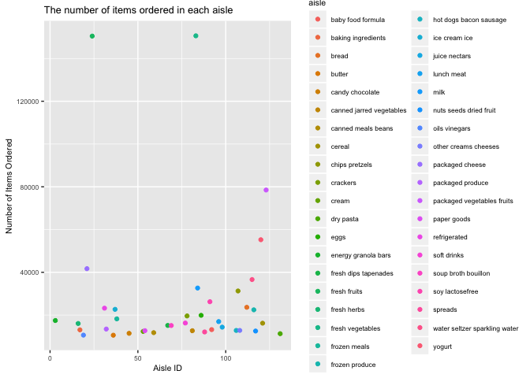
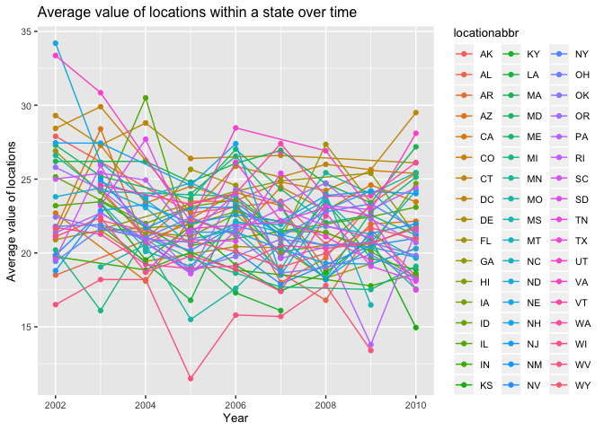
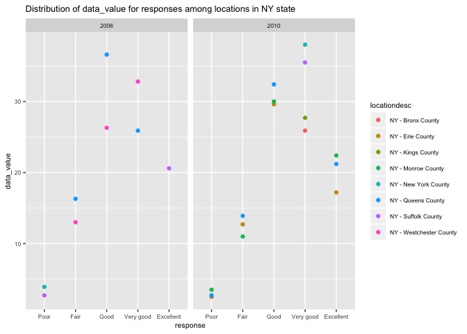

p8105\_hw2\_jf3285
================
Jiarui Fu
10/14/2019

## Problem 1

This problem uses the Instacart data.

``` r
# load the data
library(p8105.datasets)
data("instacart") 

instacart %>% 
  # Q1: How many aisles are there, and which aisles are the most items ordered from?
  # count the number of times each aisle is ordered
  group_by(aisle_id, aisle) %>% 
  summarise(item_ordered_from_aisle=n()) %>% 
  
  # make a plot that shows the number of items ordered in each aisle
  # limit to aisles with more than 10000 items ordered
  filter(item_ordered_from_aisle > 10000) %>% 
  ggplot(aes(x = aisle_id, y = item_ordered_from_aisle)) + 
  geom_point(aes(color = aisle)) + 
  labs(title = "The number of items ordered in each aisle",
       x = "Aisle ID",
       y = "Number of Items Ordered") + theme(text = element_text(size=8))
```

<!-- -->

``` r
# make a table showing the three most popular items in the specified aisles below
instacart %>% 
  # limit to only three aisles
  filter(aisle == c("baking ingredients", "dog food care", "packaged vegetables fruits")) %>% 
  # count the number of times each item is ordered
  group_by(aisle, product_name) %>%
  summarise(number_of_times_item_ordered=n()) %>% 
  # keep the three most popular items in each of the aisles
  filter(min_rank(desc(number_of_times_item_ordered)) < 4) %>% 
  knitr::kable()
```

| aisle                      | product\_name                                   | number\_of\_times\_item\_ordered |
| :------------------------- | :---------------------------------------------- | -------------------------------: |
| baking ingredients         | Light Brown Sugar                               |                              157 |
| baking ingredients         | Organic Vanilla Extract                         |                              122 |
| baking ingredients         | Pure Baking Soda                                |                              140 |
| dog food care              | Organix Chicken & Brown Rice Recipe             |                               13 |
| dog food care              | Organix Grain Free Chicken & Vegetable Dog Food |                               14 |
| dog food care              | Original Dry Dog                                |                                9 |
| packaged vegetables fruits | Organic Baby Spinach                            |                             3324 |
| packaged vegetables fruits | Organic Blueberries                             |                             1692 |
| packaged vegetables fruits | Organic Raspberries                             |                             1920 |

``` r
# make a table showing the mean hour of the day at which the specified products are ordered on each day of the week
# change order_dow's data type to factor
instacart$order_dow = as.factor(instacart$order_dow)
instacart %>% 
  # recode order_dow into each day of the week based on 0-6 = Sun to Sat
  mutate(order_dow = recode(order_dow, 
                            "0" = "Sun", "1" = "Mon", "2" = "Tue", "3" = "Wed", 
                            "4" = "Thu", "5" = "Fri", "6" = "Sat")) %>% 
  # limit to only two products
  filter(product_name == c("Pink Lady Apples", "Coffee Ice Cream")) %>% 
  # count the mean hour of the day at which they are ordered on each day of the week 
  group_by(order_dow, product_name) %>% 
  summarise(mean_hour = mean(order_hour_of_day)) %>% 
  # produce a 2*7 table 
  pivot_wider(id_cols = c(order_dow, product_name, mean_hour),
              names_from = order_dow,
              values_from = mean_hour) %>% 
  knitr::kable(digits = 1)
```

    ## Warning in product_name == c("Pink Lady Apples", "Coffee Ice Cream"):
    ## longer object length is not a multiple of shorter object length

| product\_name    |  Sun |  Mon |  Tue |  Wed |  Thu |  Fri |  Sat |
| :--------------- | ---: | ---: | ---: | ---: | ---: | ---: | ---: |
| Coffee Ice Cream | 13.2 | 15.0 | 15.3 | 15.4 | 15.2 | 10.3 | 12.4 |
| Pink Lady Apples | 12.2 | 11.7 | 12.0 | 13.9 | 11.9 | 13.9 | 11.6 |

The instacart dataset has 1384617 rows and 15 columns. Some key
variables are…

Q1. There are 134 aisles. Aisle 83 (fresh vegetables, most) and aisle 24
(fresh fruits, second most) are the most items ordered from.

## Problem 2

``` r
# load the data
library(p8105.datasets)
data("brfss_smart2010")

# change response's data type to factor
brfss_smart2010$Response = as.factor(brfss_smart2010$Response)
# data cleaning
tidy_data = 
brfss_smart2010 %>% 
  janitor::clean_names() %>% 
  # focus on the "Overall Health" topic
  filter(topic == "Overall Health") %>% 
  # include only responses from "Excellent" to "Poor"
  filter (response == c("Excellent", "Very good", "Good", "Fair", "Poor")) %>% 
  # organize responses as a factor taking levels ordered from “Poor” to “Excellent”
  mutate(response = forcats::fct_relevel(response, c("Poor", "Fair", "Good", "Very good", "Excellent"))) %>% 
  arrange(response)
tidy_data
```

    ## # A tibble: 7,121 x 23
    ##     year locationabbr locationdesc class topic question response
    ##    <int> <chr>        <chr>        <chr> <chr> <chr>    <fct>   
    ##  1  2010 AL           AL - Jeffer… Heal… Over… How is … Poor    
    ##  2  2010 AL           AL - Mobile… Heal… Over… How is … Poor    
    ##  3  2010 AL           AL - Tuscal… Heal… Over… How is … Poor    
    ##  4  2010 AZ           AZ - Marico… Heal… Over… How is … Poor    
    ##  5  2010 AZ           AZ - Pinal … Heal… Over… How is … Poor    
    ##  6  2010 AR           AR - Benton… Heal… Over… How is … Poor    
    ##  7  2010 AR           AR - Pulask… Heal… Over… How is … Poor    
    ##  8  2010 AR           AR - Washin… Heal… Over… How is … Poor    
    ##  9  2010 CA           CA - Alamed… Heal… Over… How is … Poor    
    ## 10  2010 CA           CA - Los An… Heal… Over… How is … Poor    
    ## # … with 7,111 more rows, and 16 more variables: sample_size <int>,
    ## #   data_value <dbl>, confidence_limit_low <dbl>,
    ## #   confidence_limit_high <dbl>, display_order <int>,
    ## #   data_value_unit <chr>, data_value_type <chr>,
    ## #   data_value_footnote_symbol <chr>, data_value_footnote <chr>,
    ## #   data_source <chr>, class_id <chr>, topic_id <chr>, location_id <chr>,
    ## #   question_id <chr>, respid <chr>, geo_location <chr>

``` r
# Q1: In 2002, which states were observed at 7 or more locations? What about in 2010?
# year 2002
tidy_data %>% 
  # set year = 2002
  filter(year == 2002) %>% 
  # count the number of locations that each state was observed at
  group_by(locationabbr) %>% 
  summarise(number_of_locations = n()) %>% 
  # set observations at 7 or more locations
  filter(number_of_locations >= 7)
```

    ## # A tibble: 21 x 2
    ##    locationabbr number_of_locations
    ##    <chr>                      <int>
    ##  1 CT                            17
    ##  2 DE                            15
    ##  3 FL                            30
    ##  4 ID                            10
    ##  5 IL                            15
    ##  6 IN                            10
    ##  7 MA                            15
    ##  8 MD                            17
    ##  9 MI                            10
    ## 10 NE                             8
    ## # … with 11 more rows

``` r
# year 2010
tidy_data %>% 
  # set tear = 2010
  filter(year == 2010) %>% 
  # count the number of locations that each state was observed at
  group_by(locationabbr) %>% 
  summarise(number_of_locations = n()) %>%
  # set observations at 7 or more locations
  filter(number_of_locations >= 7)
```

    ## # A tibble: 38 x 2
    ##    locationabbr number_of_locations
    ##    <chr>                      <int>
    ##  1 AL                            15
    ##  2 AR                            15
    ##  3 AZ                            10
    ##  4 CA                            55
    ##  5 CO                            35
    ##  6 DE                            15
    ##  7 FL                           139
    ##  8 ID                            20
    ##  9 IN                             8
    ## 10 KS                            11
    ## # … with 28 more rows

``` r
# Q2
tidy_data %>% 
  # limit to Excellent responses
  filter(response == "Excellent") %>%
  # contain year, state
  group_by(year, locationabbr) %>% 
  # create a new variable that averages the data_value across locations within a state
  summarise(avg_data_value = mean(data_value)) %>% 
  # make a “spaghetti” plot of this average value over time within a state
  # make a plot showing a line for each state across years
  ggplot(aes(x = year, y = avg_data_value, color = locationabbr)) + 
  geom_point() +
  geom_line(aes(group = locationabbr)) + 
  labs(title = "Average value of locations within a state over time",
       x = "Year",
       y = "Average value of locations") + theme(text = element_text(size=10))
```

    ## Warning: Removed 3 rows containing missing values (geom_point).

    ## Warning: Removed 2 rows containing missing values (geom_path).

<!-- -->

``` r
# Q3
# make a two-panel plot showing, for the years 2006, and 2010, distribution of data_value for responses (“Poor” to “Excellent”) among locations in NY State
tidy_data %>% 
  # set year = 2006 and 2010
  filter(year == c(2006, 2010)) %>% 
  # set location in NY State
  filter(locationabbr == "NY") %>% 
  # two-panel plot
  ggplot(aes(x = response, y = data_value, color = locationdesc)) +
  geom_point() + 
  labs(title = "Distribution of data_value for responses among locations in NY state",
       x = "response",
       y = "data_value") + theme(text = element_text(size=8)) +
  facet_grid(~year)
```

    ## Warning in year == c(2006, 2010): longer object length is not a multiple of
    ## shorter object length

<!-- -->

Q1. In 2002, 21 states were observed at 7 or more locations, including
CT, DE, FL, ID, IL, IN, MA, MD, MI, NE, NH, NJ, NV, NY, OH, OK, PA, RI,
SC, UT and WA.  
In 2010, 38 states were observed at 7 or more locations, including AL,
AR, AZ, CA, CO, DE, FL, ID, IN, KS, LA, MA, MD, ME, MI, MN, MO, MT, NC,
NE, NH, NJ, NM, NV, NY, OH, OK,OR, PA, RI, SC, SD, TN, TX, UT, VT, WA
AND WY.

## Problem 3

``` r
accel_data = 
  # load, tidy the data
  read_csv("data/accel_data.csv") %>%
  janitor::clean_names() %>%
  # include a weekday vs weekend variable
  mutate(weekday_vs_weekend =
         ifelse(day %in% c("Saturday", "Sunday"), "weekend", "weekday")) %>% 
  select(week, day_id, day, weekday_vs_weekend, everything())
accel_data
```

    ## # A tibble: 35 x 1,444
    ##     week day_id day   weekday_vs_week… activity_1 activity_2 activity_3
    ##    <dbl>  <dbl> <chr> <chr>                 <dbl>      <dbl>      <dbl>
    ##  1     1      1 Frid… weekday                88.4       82.2       64.4
    ##  2     1      2 Mond… weekday                 1          1          1  
    ##  3     1      3 Satu… weekend                 1          1          1  
    ##  4     1      4 Sund… weekend                 1          1          1  
    ##  5     1      5 Thur… weekday                47.4       48.8       46.9
    ##  6     1      6 Tues… weekday                64.8       59.5       73.7
    ##  7     1      7 Wedn… weekday                71.1      103.        68.5
    ##  8     2      8 Frid… weekday               675        542       1010  
    ##  9     2      9 Mond… weekday               291        335        393  
    ## 10     2     10 Satu… weekend                64         11          1  
    ## # … with 25 more rows, and 1,437 more variables: activity_4 <dbl>,
    ## #   activity_5 <dbl>, activity_6 <dbl>, activity_7 <dbl>,
    ## #   activity_8 <dbl>, activity_9 <dbl>, activity_10 <dbl>,
    ## #   activity_11 <dbl>, activity_12 <dbl>, activity_13 <dbl>,
    ## #   activity_14 <dbl>, activity_15 <dbl>, activity_16 <dbl>,
    ## #   activity_17 <dbl>, activity_18 <dbl>, activity_19 <dbl>,
    ## #   activity_20 <dbl>, activity_21 <dbl>, activity_22 <dbl>,
    ## #   activity_23 <dbl>, activity_24 <dbl>, activity_25 <dbl>,
    ## #   activity_26 <dbl>, activity_27 <dbl>, activity_28 <dbl>,
    ## #   activity_29 <dbl>, activity_30 <dbl>, activity_31 <dbl>,
    ## #   activity_32 <dbl>, activity_33 <dbl>, activity_34 <dbl>,
    ## #   activity_35 <dbl>, activity_36 <dbl>, activity_37 <dbl>,
    ## #   activity_38 <dbl>, activity_39 <dbl>, activity_40 <dbl>,
    ## #   activity_41 <dbl>, activity_42 <dbl>, activity_43 <dbl>,
    ## #   activity_44 <dbl>, activity_45 <dbl>, activity_46 <dbl>,
    ## #   activity_47 <dbl>, activity_48 <dbl>, activity_49 <dbl>,
    ## #   activity_50 <dbl>, activity_51 <dbl>, activity_52 <dbl>,
    ## #   activity_53 <dbl>, activity_54 <dbl>, activity_55 <dbl>,
    ## #   activity_56 <dbl>, activity_57 <dbl>, activity_58 <dbl>,
    ## #   activity_59 <dbl>, activity_60 <dbl>, activity_61 <dbl>,
    ## #   activity_62 <dbl>, activity_63 <dbl>, activity_64 <dbl>,
    ## #   activity_65 <dbl>, activity_66 <dbl>, activity_67 <dbl>,
    ## #   activity_68 <dbl>, activity_69 <dbl>, activity_70 <dbl>,
    ## #   activity_71 <dbl>, activity_72 <dbl>, activity_73 <dbl>,
    ## #   activity_74 <dbl>, activity_75 <dbl>, activity_76 <dbl>,
    ## #   activity_77 <dbl>, activity_78 <dbl>, activity_79 <dbl>,
    ## #   activity_80 <dbl>, activity_81 <dbl>, activity_82 <dbl>,
    ## #   activity_83 <dbl>, activity_84 <dbl>, activity_85 <dbl>,
    ## #   activity_86 <dbl>, activity_87 <dbl>, activity_88 <dbl>,
    ## #   activity_89 <dbl>, activity_90 <dbl>, activity_91 <dbl>,
    ## #   activity_92 <dbl>, activity_93 <dbl>, activity_94 <dbl>,
    ## #   activity_95 <dbl>, activity_96 <dbl>, activity_97 <dbl>,
    ## #   activity_98 <dbl>, activity_99 <dbl>, activity_100 <dbl>,
    ## #   activity_101 <dbl>, activity_102 <dbl>, activity_103 <dbl>, …

``` r
accel_data %>%  
  mutate(total_activity_daily = rowSums(.[5:1444])) %>% 
  select(week, day_id, day, weekday_vs_weekend, total_activity_daily)
```

    ## # A tibble: 35 x 5
    ##     week day_id day       weekday_vs_weekend total_activity_daily
    ##    <dbl>  <dbl> <chr>     <chr>                             <dbl>
    ##  1     1      1 Friday    weekday                         480543.
    ##  2     1      2 Monday    weekday                          78828.
    ##  3     1      3 Saturday  weekend                         376254 
    ##  4     1      4 Sunday    weekend                         631105 
    ##  5     1      5 Thursday  weekday                         355924.
    ##  6     1      6 Tuesday   weekday                         307094.
    ##  7     1      7 Wednesday weekday                         340115.
    ##  8     2      8 Friday    weekday                         568839 
    ##  9     2      9 Monday    weekday                         295431 
    ## 10     2     10 Saturday  weekend                         607175 
    ## # … with 25 more rows
